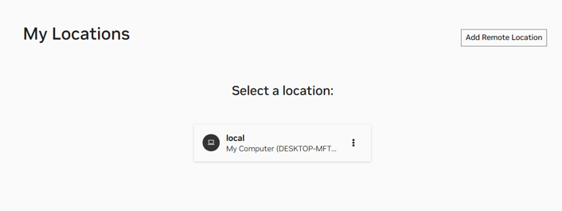
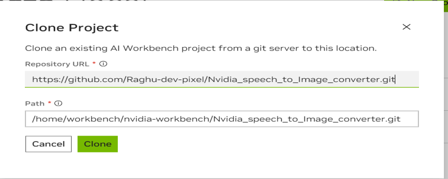
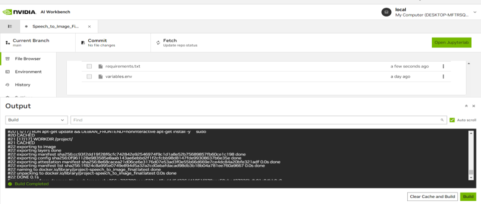
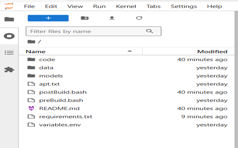
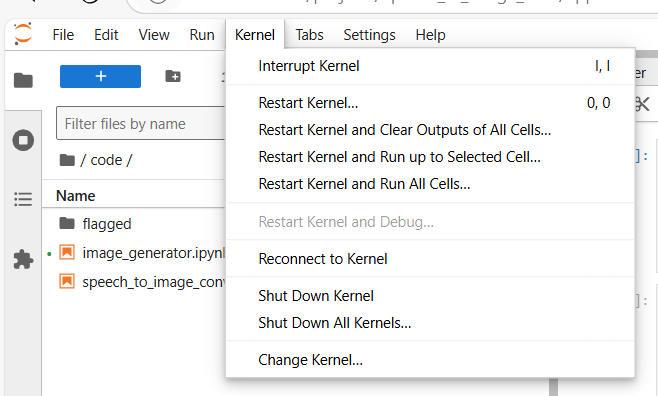
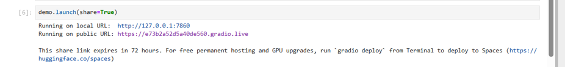

# Speech to Image Converter
This project titled **Speech-to-image Converter** aims to generate images based on audio/speech as input by leveraging the benefits of Nvidia's AI workbench. The project can be used in various educational and storytelling applications.

## Description
The Speech-to-Image Converter is an advanced generative AI system that allows users to create real-time images from spoken or audio descriptions. While existing generative AI applications such as speech-to-text and text-to-image converters are well-established, little attention has been given to the direct conversion of speech into images. This project aims to bridge that gap by developing a seamless solution using NVIDIA's AI Workbench to convert audio inputs into visual content.

For example, if a user says, **Lion in a Jungle in 4K** the application transcribes the audio and instantly generates a high-resolution image of a lion in the jungle. This provides an intuitive way to transform verbal ideas into visuals, offering new creative opportunities.

**Setup and Tools**
The project utilizes NVIDIA AI Workbench, a platform that simplifies GPU workstation setup, enabling developers to seamlessly work across different hardware environments. It ensures that even users without a local GPU can run the application effectively.

**Architecture Overview**
The system architecture is divided into two key modules:

1) **Speech-to-Text Conversion**
This module leverages OpenAI's Whisper model to transcribe spoken audio into text. Whisper's ability to handle various languages and noisy environments makes it ideal for this task, ensuring that the application is not limited to specific languages or pristine audio quality.
* **Device Optimization**: The system detects whether a GPU is available and automatically uses it for faster processing, otherwise defaulting to the CPU.
* **Processing**: The ASR model processes audio files in 30-second chunks to ensure efficient handling, providing the transcribed text as input to the next module.

2) **Text-to-Image Conversion**
This module generates images from the text output using NVIDIA's Stable Diffusion AI model.
* **API Usage**: It connects to NVIDIA’s GenAI Stable Diffusion API, authenticating with an API key, and sends the transcribed text along with various image generation parameters (such as sampling method, quality scaling, seed, and steps) to the model.
* **Image Generation**: The generated image is returned in base64 format, decoded, and converted into an image using the Python Imaging Library (PIL), which can then be displayed or saved.

**Key Benefits**
1) **Cross-Platform Compatibility**: The application can be run with or without a local GPU, thanks to NVIDIA’s cloud-based APIs.
2) **Language Independence**: The system supports multiple languages for audio input, making it versatile and accessible to a global audience.
3) **Efficient Processing**: By leveraging pre-trained models from NVIDIA's API, the application avoids the need for local model training, ensuring faster image generation.
4) **Ease of Use**: The use of NVIDIA AI Workbench ensures that the project can be easily cloned and run across different platforms, making it accessible to users with diverse hardware setups.

This speech-to-image converter redefines the creative process, enabling users to generate visuals directly from spoken descriptions, whether for design, education, or storytelling purposes.

## Getting Started
The Speech-to-Image Converter application can be used by following a few simple steps described below:
1) **Installation**: Install [Nvidia's AI workbench](https://www.nvidia.com/en-us/deep-learning-ai/solutions/data-science/workbench/). To make use of AI workbench it is also necessary to have [Docker Desktop](https://docs.docker.com/desktop/install/windows-install/) installed.

2) **Cloning the Project**:
* Once the Nvidia AI workbench and docker desktop has been installed successfully, open the AI workbench and choose the location where the project needs to be executed, it can either be local or remote as shown in the figure.
* Once the location to execute the project has been selected, there are two options. Either a new project can be created or clone an already existing project and since we already have our project in GitHub, we can clone the [speech to image converter application project](https://github.com/Raghu-dev-pixel/Nvidia_speech_to_Image_converter.git) and then click on the clone option..
* Once the project is cloned, the project starts building automatically, allow the build to complete, and as soon as the build is successful open the Jupyterlab in the right-hand side corner. .

3) **Running the Speech-to-Image-Converter Application**:
* The code for this project is present in a directory called "code". . Inside the code directory there are two files "speech_to_image_converter.ipynb". This is the main file that has the code to process audio from the user using OpenAI's whisper AI model and the text that is generated is converted to an image by passing the text to a text-to-image converter function present in the "image_generator.ipynb" file which internally works by calling Nvidia's API of a stable diffusion logic.
* To run the application, open the "speech_to_image_converter.ipynb" file click on the kernel, and then select "Restart Kernel and Run All Cells".
  .
* The execution of the program begins and once the execution is completed, a gradio link pops up at the bottom of the file and by selecting the URL "Running on public URL", it redirects us to a webpage where we have our speech-to-image-conversion application.

4) **Using the Speech-to-Image-Converter Application**:
* Play around with the application, with different audio inputs.
* The application supports direct speech input from the user if access to a microphone is allowed by the user and it is also possible to upload recorded audio files. And at the output, we get an image of what has been said in the audio input and this application also supports multiple languages.
* For instance in our example, the user says "Bengal Tiger" and at the output, we have an image of "Bengal Tiger".
  .

## Requirements
The project and the application were tested under the specifications mentioned below:
* Operating system: Ubuntu 20.04
* CPU requirements: None, tested with Intel ®Xeon® Platinum 830 CPU @2.30GHz.
* GPU Used: Tesla T4. However, it also works for other GPUs, provided all the latest drivers are installed.
* Storage requirements: 40GB

## Further Improvements
The following ideas can be thought of for further improvement.
* Currently we are using Nvidia's API from the catalog to generate an image from text, instead of doing that it would also be nice to train and use a stable diffusion model directly, with this approach we could also generate our images of ourselves. For example "Raghu in space" this would then give an image of me in space.
* The idea could further be extended for videos, i.e. to generate videos based on audio inputs.
* We could also try to create our emojis and memes as part of an extension to this project.

## Aditional Information
Since we are using NVIDIA's API for stable diffusion to convert text to image, it is essential to have a API key generated. The API key can be generated using the below steps:
1) Login to the [Nvidia NGC catalog](https://catalog.ngc.nvidia.com/?filters=&orderBy=weightPopularDESC&query=&page=&pageSize=) and login with your email ID.
2) Create your account, and give an account name of your choice, and select "Create Nvidia Cloud Account".
3) Fill in all your details and click on the submit button.
4) Once you have your account created, login to the NGC account with your email and click on your email account at the right-hand top corner, and then select the setup option.
5) Select the "Generate Personal Key" from the menu and then again click on the "Generate Personal key" at the middle of the page.
6) Once this is done copy the personal key that is generated and save it in your notepad after which we can sign out from the account.
7) This newly created API key must be used in the code where we are invoking Nvidia's API to convert text to image, for this go back to the code in the Jupyter lab and open the file "image_generator.ipynb". Replace the Nvidia API key already present in the headers section of the code with the key generated and save the file.

Note:- The above-mentioned steps for API creation are not needed for the moment as I have created my key from my account explicitly created for this demo purpose, however, if the application does not work right away as described earlier this is one option that could be checked.

The presentation for this project can be found in [Download the presentation](./data/HackAI_ppt.pptx).