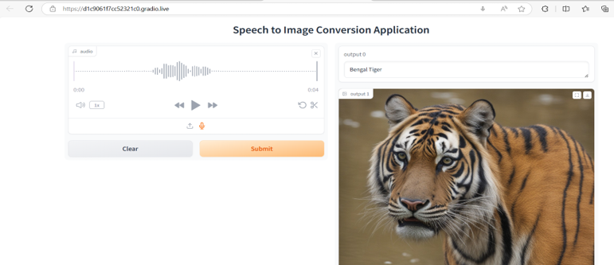

# Speech to Image Converter with Nvidia AI Workbench
Transforming speech or audio files into pictures by using Nvidia's AI workbench and APIs.

# Introduction:
Artificial Intelligence(AI) dates back to 1950 when computers were used to simulate intelligent behavior. This act of stimulating intelligence is called AI. What began as a simple software program, AI is now advanced and includes several complex algorithms, and can even perform functions similar if not better than human beings. AI has evolved significantly over the last few years, especially with the advent of machine learning (ML) and Deep Learning (DL). ML is a subset of AI, and DL is a subset of ML. Likewise, there was yet another breakthrough in AI with the introduction of **Large Language Models (LLMs)**. [LLMs](https://www.geeksforgeeks.org/large-language-model-llm/) employ neural network techniques with extensive parameters for advanced language processing.

A large language model is a type of artificial intelligence algorithm that applies neural network techniques with lots of parameters to process and understand human languages or text using self-supervised learning techniques. Tasks like text generation, machine translation, summary writing, image generation from texts, machine coding, chat-bots, or Conversational AI are applications of the Large Language Model. Examples of such LLM models are Chat GPT by open AI, BERT (Bidirectional Encoder Representations from Transformers) by Google, etc.

Many techniques were tried to perform natural language-related tasks but the LLM is purely based on the deep learning methodologies. LLM (Large language model) models are highly efficient in capturing the complex entity relationships in the text at hand and can generate the text using the semantic and syntactic of that particular language.

# The Idea:
In today’s fast-evolving world of AI, we've seen remarkable advances in LLMs which have made it easier to implement chatbots and video generation applications. Additionally, we also have speech-to-text converters and text-to-image converters. But what if we could combine these technologies to convert spoken words directly into vivid images? That’s exactly what Speech-to-Image Converter aims to achieve, using the powerful tools provided by NVIDIA's AI Workbench. Whether it's for storytelling, design, or educational purposes, this project pushes the boundaries of creative technology, making it easier than ever to visualize ideas from speech.

Imagine being able to speak your thoughts and have them transformed into images in real time. This system turns spoken descriptions into visuals. If you say something like "Lion in a jungle in 4K," within moments, a high-resolution image of that exact description appears before you.

This innovative approach opens up new avenues for creativity, allowing users to express their ideas and concepts without needing advanced technical skills. The beauty of this system lies in its intuitive nature—just speak your mind, and let the technology do the rest!

# Design and Implementation:
This application uses two advanced AI models to make this happen:
1. **Speech-to-Text**: OpenAI's **Whisper model**, is used to transform/transcribe spoken words into text. This model is accurate even in noise and supports multiple languages. Audio is processed in real-time, ensuring that users experience minimum delays between speaking and seeking their visualized ideas.
2. **Text-to-Image**: A stable diffusion is used not directly but indirectly to generate images that match the spoken description. This model has gained popularity for its ability to produce high-quality, detailed visuals which is essential for maintaining a smooth user experience.

So in this project, the features of these two models are combined. The whisper model receives audio and converts it into text and stable diffusion converts this text into an image. And I have used **Gradio** for the demo which provides us with a simple friendly web interface so that anyone can use it, anywhere. The input is audio and the output on the **Gradio** based webui is the corresponding image.

# What's Unique:
Though this idea seems innovative and unique, it is often the case that someone somewhere would have already thought about the idea and implemented it using a similar approach. But these are some of the unique factors that could differentiate this project when compared with other solutions:
1) **Nvidia AI Workbench**: As expected in this hackathon, the project has been built and tested on [Nvidia's AI workbench](https://www.nvidia.com/en-us/deep-learning-ai/solutions/data-science/workbench/) wherein we have analyzed and made use of most of the features that Nvidia's AI workbench offers and for anyone else that wishes to use it, they can just [clone the project](https://github.com/Raghu-dev-pixel/Nvidia_speech_to_Image_converter.git) and test it without having to bother about setting the environment and so on.
2) **Multiple Languages**: This application has been tested with different languages as input (German, French, and Hindi) not just with English.
3) **Nvidia's NIM usage**: Since text-to-image conversion uses a stable diffusion model, it requires hardware with a faster processing unit (GPU) because it needs to train on a very large dataset. However, GPUs are not cheap and expensive to use, especially for students and academic staff which is why **Nvidia's NIM** which is nothing but a set of easy-to-use inference microservices are used in the deployment of the text-to-image conversion. With [Nvidia's pre-trained models](https://build.nvidia.com/explore/discover), there's no need for local training, meaning faster results. The ability to harness cloud computing power allows users to focus on creativity rather than the technical limitations of their local environment.
The code in my project is written in such a way that the application works with or without GPU with an "availability of CUDA check". So if the user is using a CPU and running this application it still runs with the same speed as that in case of a presence of a GPU. What makes this project unique though there might be others who have implemented a speech-to-image conversion application is the use of this functionality offered by Nvidia.

# Challenges addressed:
Multiple challenges were addressed, however, some of them are worth mentioning:
1) **AI Workbench Installation Error**: When I was trying to initially install AI workbench on my laptop. I was unable to do it because I was getting an application error. This issue was because of the virtualization setting in the BIOS and configuring the Virtual Machine Platform. For the AI workbench to work, the virtualization in the BIOS must be enabled which was disabled in my case, however, once I enabled it AI workbench installation was successful.
2) **Build Hang**: When installing the torch audio library on a Pytorch21 series container with cuda already installed on it, the build was hanging because of incompatible versions between the torch audio and the already available torch libraries to overcome this, I used a basic Python container without Pytorch pre-installed in it and installed the needed libraries on the basic python container with which I did not face any errors and the build went through.
3) **Disk Space**: The application usually requires 40GB including creating an image, building, etc but in my case after step 2, the disk was continuously getting occupied and it was more than 80GB and I was not able to free the disk space even with project deletion and uninstallation of Docker. As a workaround to overcome this issue, the cache was cleaned on the disk drive C which also ensured that all the temporary files that were holding onto some of the background docker files were removed and then the docker was reinstalled after which the disk space was recovered.
4) **No GPUs**: As a student, it was very challenging to make use of a GenAI code, because they train with higher datasets and most often require a GPU. To overcome this drawback Nvidia's API was used for the stable diffusion logic of implementing a text-to-image converter. Google Colab's GPU could not be made use of because Nvidia's AI workbench currently does not support access to Google Colab's GPUs.

However, since the program is also expected to work on a GPU platform the application was also run on Google Colab's GPU to ensure its functionality works even on a GPU.

